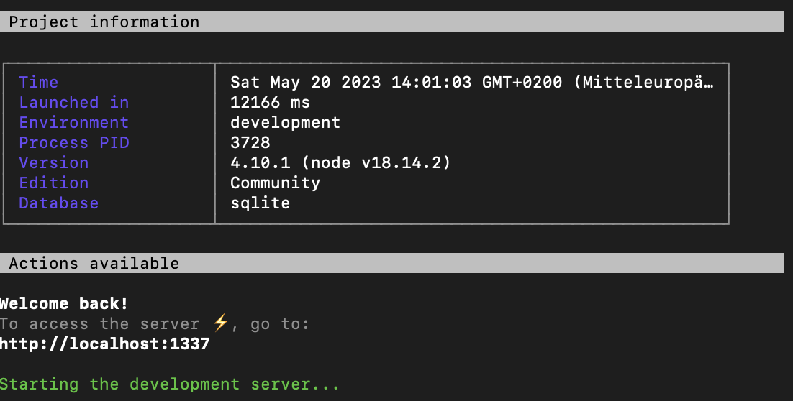
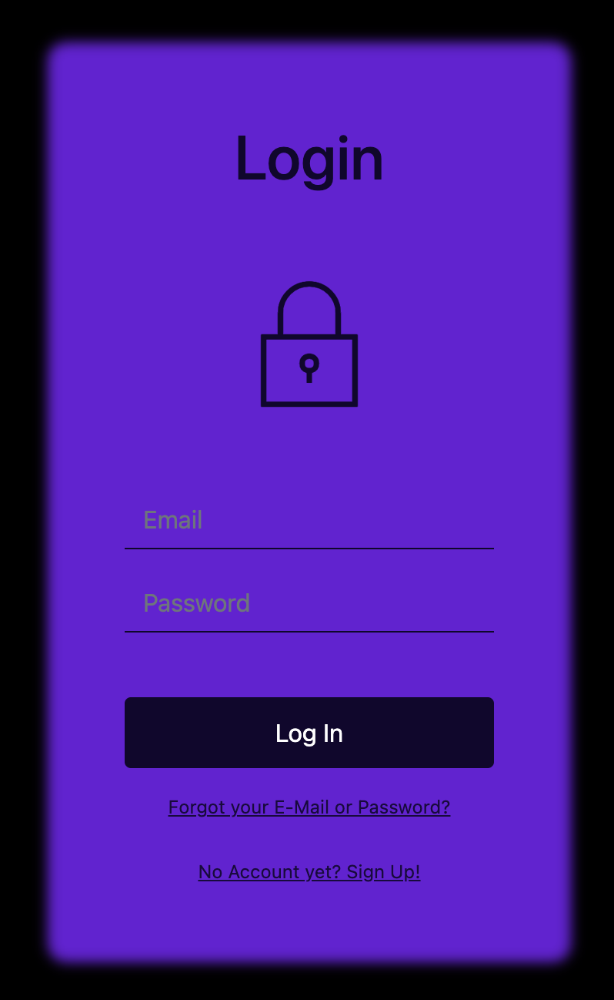
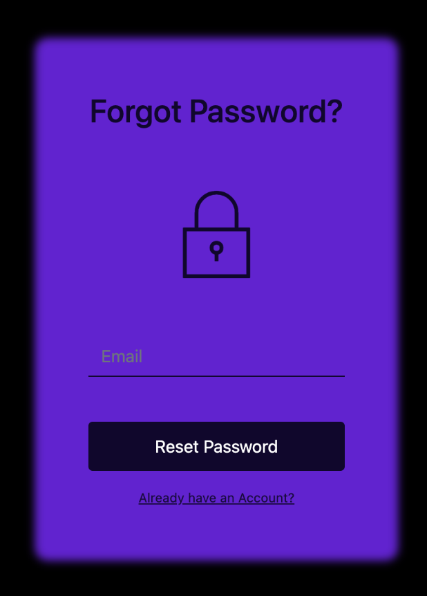
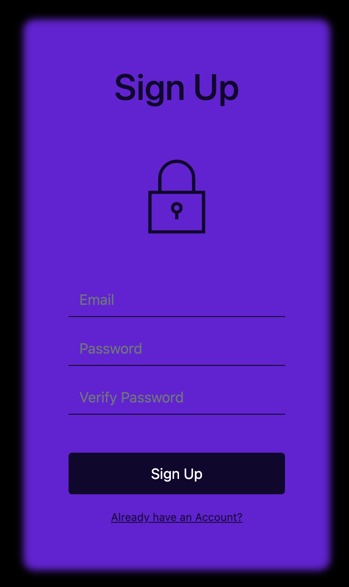
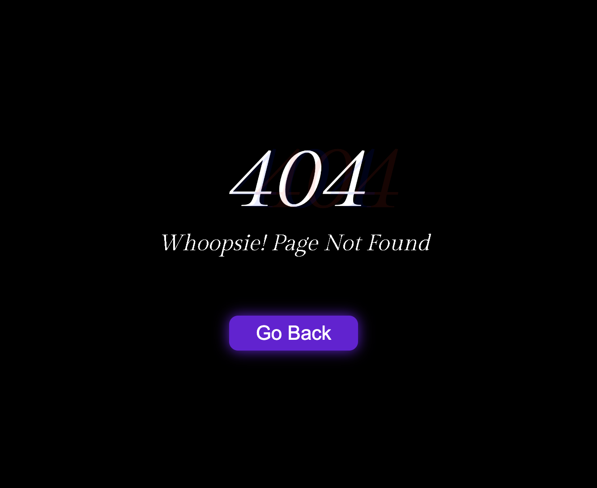

# 99Deals

## Überblick

99Deals ist eine aufregende und einzigartige E-Commerce Plattform. Jeden Tag werden vier spezielle Deals von vier verschiedenen Unternehmen angeboten, wobei jeder Deal auf nur 99 Stück limitiert ist. Die Plattform ist unkompliziert, neuzeitlich und bietet den Nutzern ein spannendes Einkaufserlebnis. Sie wurde mit [Angular](https://angular.io/) und [Strapi](https://strapi.io/) als Headless CMS erstellt.

## Installation und Start

Um mit Angular zu arbeiten, benötigen Sie die folgenden Tools:

- **Node.js**: Angular erfordert eine aktuelle, aktive LTS- oder eine stabile Version von Node.js. Besuchen Sie die [Node.js-Website](https://nodejs.org/) um Node.js herunterzuladen und zu installieren.
- **npm package manager**: Angular, das Angular CLI und Angular-Anwendungen sind auf npm-Paketen angewiesen. Der [npm package manager](https://www.npmjs.com/get-npm) wird mit Node.js verteilt und sollte daher bereits auf Ihrem System installiert sein.
- **Angular CLI**: Das Angular CLI ist ein Befehlszeilenwerkzeug, das Sie für die Erstellung und Verwaltung von Angular-Anwendungen verwenden können. Installieren Sie das Angular CLI global auf Ihrem System mit dem folgenden Befehl:

  ```bash
  npm install -g @angular/cli
  ```
- **Visual Studio Code**: Dies ist ein empfohlener Code-Editor für die Arbeit mit Angular. Sie können ihn von der [Visual Studio Code-Website](https://code.visualstudio.com/download) herunterladen und installieren. Es enthält hilfreiche Features wie Syntax-Highlighting, Autocomplete, und eine eingebaute Terminal-Konsole.

  Zusätzlich empfehlen wir, die Angular Essentials Extension Pack für Visual Studio Code zu installieren. Dieses Paket enthält eine Sammlung von Erweiterungen, die die Angular-Entwicklung vereinfachen. Sie können es von der [Visual Studio Code Marketplace](https://marketplace.visualstudio.com/items?itemName=johnpapa.angular-essentials) herunterladen.

Folgen Sie diesen Schritten, um das Projekt auf Ihrem lokalen System aufzusetzen:

#### Backend

1. Download Strapi Server (Alle Files und Directories) vom `new_main` Branch (Dieser Ordner muss separat auf dem lokalen Gerät  gespeichert sein >> **Nicht im selbem Verzeichnis speichern wie das Angular Repo!**)
2. Öffnen der Konsole (CMD bzw. Terminal)
3. Wechseln ins Strapi Verzeichnis mit `cd` → Beispiel: `cd 99deals_strapi`
4. Starte Strapi Server mit: `npx strapi develop --watch-admin --browser 'google chrome' ` ← (Startet den Chrome Browser automatisch und bringt zum Login des Admin-Panels von Strapi; Port wird selbst automatisch zugewiesen) → **Kann einen Moment dauern**

   
5. Login ins Admin-Panel (Auch ohne Login möglich, Wichtig > Server nicht abschalten, CMD bzw. Terminal offen lassen)

#### Front-End

1. Klone das Repository: `git clone https://gitlab.ti.bfh.ch/dsl-student-projects/wseg-23-fs/4p-teapot.git`
2. Öffnen einer neuen Konsole (CMD bzw. Terminal)
3. Wechseln Sie in das Projektverzeichnis: `cd 4p-teapot`
4. Starten der Angular-App: `ng serve -o`, öffnet automatisch den Browser. **Kann einen Moment dauern**

Die Anwendung sollte nun auf `http://localhost:4200` (oder zugewiesenen Port) laufen.

## Notwendige Schritte für den ersten Start

Für den ersten Start der Anwendung, nachdem Sie alle Abhängigkeiten installiert und die Anwendung gestartet haben, werden Sie zuerst zur Login-Seite weitergeleitet. Da wir jedoch keine vollständige Authentifizierungsfunktion implementiert haben, werden Sie bei der ersten Anmeldung einen POST-Fehler erhalten, wenn Sie versuchen, sich mit dem Login-Button anzumelden. Dies liegt daran, dass wir keine tatsächlichen Anmeldedaten haben und die Anmeldung nur simuliert wird.

Um diese Anfangshürde zu umgehen und zur Hauptseite der Anwendung zu gelangen, geben Sie bitte `/home` direkt in die URL-Leiste Ihres Browsers ein. Dies bringt Sie direkt zur Startseite der Anwendung.

### Anwendungsnavigation und Sicherheitsrouting

Diese Anwendung wurde entwickelt, um die gängigen Muster und Best Practices einer modernen Webanwendung zu simulieren. Wir haben zwei Arten von Routing-Strukturen implementiert: Authentifizierungsrouten und Modulrouten.

## Authentifizierungsrouten

Diese Routen sind dafür verantwortlich, die Authentifizierung zu simulieren. Hier sind die Routen, die wir in dieser Kategorie definiert haben:

| Pfad        | Komponente        | Beschreibung                                                                       |
| ----------- | ----------------- | ---------------------------------------------------------------------------------- |
| `/login`  | LoginComponent    | Zeigt die Login-Seite an.                                                          |
| `/signup` | SignupComponent   | Zeigt die Anmeldeseite an.                                                         |
| `/forgot` | ForgotPwComponent | Zeigt die Seite zum Zurücksetzen des Passworts an.                                |
| `/`       |                   | Leitet den Benutzer zur Login-Seite um.                                            |
| `/home`   | HomeModule        | Leitet den Benutzer zur Hauptseite um. Dieser Pfad verwendet Lazy Loading.         |
| `**`      | NotFoundComponent | Zeigt eine 404-Seite an, wenn der Benutzer einen nicht existierenden Pfad eingibt. |

## Modulrouten

Diese Routen gehören zum Home-Modul und leiten den Benutzer zu den verschiedenen Seiten innerhalb dieses Moduls um. Hier sind die Routen, die wir in dieser Kategorie definiert haben:

| Pfad         | Komponente       | Beschreibung                           |
| ------------ | ---------------- | -------------------------------------- |
| `/about`   | AboutComponent   | Zeigt die Über-uns-Seite an.          |
| `/follow`  | FollowComponent  | Zeigt die Folgen-Seite an.             |
| `/header`  | HeaderComponent  | Zeigt die Header-Seite an.             |
| `/main`    | MainComponent    | Zeigt die Hauptseite an.               |
| `/nav`     | NavComponent     | Zeigt die Navigationsseite an.         |
| `/sponsor` | SponsorComponent | Zeigt die Sponsorenseite an.           |
| `/timer`   | TimerComponent   | Zeigt die Timer-Seite an.              |
| `/`        |                  | Leitet den Benutzer zur Hauptseite um. |

## Hinweis

Dieses Verhalten wurde bewusst so implementiert, um die Struktur einer echten Anwendung zu simulieren, bei der eine Benutzeranmeldung erforderlich wäre, um auf bestimmte Bereiche der Anwendung zuzugreifen. Wir haben jedoch beschlossen, auf die Implementierung einer vollständigen Authentifizierung zu verzichten, da dies nicht im Fokus unserer App-Entwicklung lag.


## Struktur der Anwendung und dynamischer Inhalt

Die Anwendung ist modular aufgebaut und in verschiedene Hauptkomponenten unterteilt, die für spezifische Funktionen innerhalb der Anwendung verantwortlich sind. Hier sind die Schlüsselkomponenten und deren Funktionen:

- **Authentifizierungsmodul**: Dieses Modul verwaltet die Authentifizierungsfunktionen der Anwendung und enthält verschiedene Komponenten für den Login, die Registrierung, das Zurücksetzen des Passworts und eine 404-Komponente für die Fehlerbehandlung.

   
   
  
   

- **Hauptmodul**: Dieses Modul umfasst die Hauptseite und besteht aus mehreren spezialisierten Komponenten, darunter:

    | Komponente | Beschreibung                                                                                          | Dynamischer Inhalt von Strapi |
    | ---------- | ----------------------------------------------------------------------------------------------------- | ----------------------------- |
    | Navigation | Die Navigationskomponente enthält das obere Menü mit dem Anwendungslogo und den Navigationsbuttons. | Nein                          |
    | Hero       | Diese Komponente präsentiert einen Begrüßungstext und eine kurze Einführung in 99Deals.           | **Ja**                             |
    | Main       | Diese Komponente zeigt die Deal-Angebote in einer Spalte an.                                          | **Ja**                            |
    | Sponsors   | Die Sponsorenkomponente zeigt die Logos der Sponsoren an.                                             | **Ja**                             |
    | About      | Diese Komponente zeigt Textabschnitte und das Logo von 99Deals.                                       | **Ja**                             |
    | Follow     | Die Follow-Komponente zeigt die Logos und URLs der Social-Media-Kanäle von 99Deals an.               | Nein                          |

    

## 3rd-Party Libraries for Angular Project

This project makes use of various third-party libraries to facilitate development and enhance functionality. Here's a list of the key libraries along with their respective versions used:

- [@angular/animations](https://www.npmjs.com/package/@angular/animations): ^15.2.0
- [@angular/common](https://www.npmjs.com/package/@angular/common): ^15.2.0
- [@angular/compiler](https://www.npmjs.com/package/@angular/compiler): ^15.2.0
- [@angular/core](https://www.npmjs.com/package/@angular/core): ^15.2.0
- [@angular/forms](https://www.npmjs.com/package/@angular/forms): ^15.2.0
- [@angular/platform-browser](https://www.npmjs.com/package/@angular/platform-browser): ^15.2.0
- [@angular/platform-browser-dynamic](https://www.npmjs.com/package/@angular/platform-browser-dynamic): ^15.2.0
- [@angular/router](https://www.npmjs.com/package/@angular/router): ^15.2.0
- [@fortawesome/angular-fontawesome](https://www.npmjs.com/package/@fortawesome/angular-fontawesome): ^0.12.1
- [@fortawesome/fontawesome-svg-core](https://www.npmjs.com/package/@fortawesome/fontawesome-svg-core): ~1.2.36
- [@fortawesome/free-solid-svg-icons](https://www.npmjs.com/package/@fortawesome/free-solid-svg-icons): ^5.15.4
- [@ng-bootstrap/ng-bootstrap](https://www.npmjs.com/package/@ng-bootstrap/ng-bootstrap): ^14.1.1
- [@popperjs/core](https://www.npmjs.com/package/@popperjs/core): ^2.11.6
- [bootstrap](https://www.npmjs.com/package/bootstrap): ^5.2.3
- [font-awesome](https://www.npmjs.com/package/font-awesome): ^4.7.0
- [fortawesome](https://www.npmjs.com/package/fortawesome): ^0.0.1-security
- [rxjs](https://www.npmjs.com/package/rxjs): ~7.8.0
- [tslib](https://www.npmjs.com/package/tslib): ^2.3.0
- [zone.js](https://www.npmjs.com/package/zone.js): ~0.12.0

## APIs

Our application interacts with the following APIs:

- [REST API Strapi](https://strapi.io/): An open-source Node.js Headless CMS to easily build customizable APIs. We use Strapi for all of our application's data management needs, including fetching and managing the dynamic contents displayed across different components.

